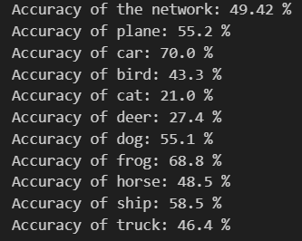

# Convolutional Neural Network for CIFAR-10 Classification Using PyTorch

This project implements a Convolutional Neural Network (CNN) using PyTorch to classify images from the CIFAR-10 dataset into 10 different categories.

## Project Overview

The aim of this project is to:
- Understand and implement convolutional neural networks using PyTorch.
- Train a deep learning model to classify images into 10 categories.
- Evaluate and visualize model performance.

## Features

- Load and normalize CIFAR-10 dataset using `torchvision`.
- Define a CNN architecture with convolutional, pooling, and fully connected layers.
- Train the model using cross-entropy loss and stochastic gradient descent.
- Test model accuracy on unseen test images.
- Confusion matrix for more detailed evaluation.

## Dataset

The [CIFAR-10 dataset](https://www.cs.toronto.edu/~kriz/cifar.html) consists of 60,000 32x32 color images in 10 classes, with 6,000 images per class:

- **Training set:** 50,000 images
- **Test set:** 10,000 images

Classes include: plane, car, bird, cat, deer, dog, frog, horse, ship, truck.

The dataset is downloaded using `torchvision.datasets.CIFAR10`.

## Technologies Used

- Python 3
- PyTorch
- Torchvision
- Matplotlib
- NumPy

## Model

The Convolutional Neural Network (CNN) used in this project consists of the following layers:

1. **Conv2d**: 3 input channels, 6 output channels, 5x5 kernel
2. **ReLU Activation**
3. **MaxPool2d**: 2x2 pooling
4. **Conv2d**: 6 input channels, 16 output channels, 5x5 kernel
5. **ReLU Activation**
6. **MaxPool2d**: 2x2 pooling
7. **Fully Connected Layer**: input 16×5×5, output 120
8. **ReLU Activation**
9. **Fully Connected Layer**: 120 to 84
10. **ReLU Activation**
11. **Fully Connected Layer**: 84 to 10 (one for each class)

## Results

- Achieved significant classification accuracy on CIFAR-10 dataset.

